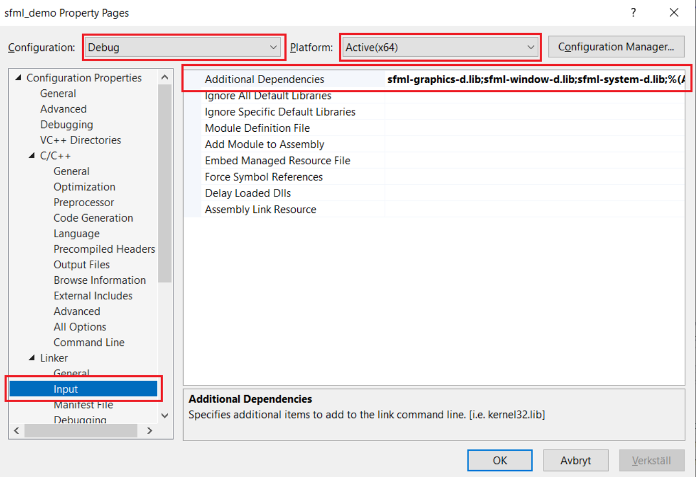

# Sätta upp SFML

## 1. Nedladdning

Ladda hem senaste versionen av SFML från deras hemsida. Var väldigt noga med vilken version du väljer då den måste stämma överens med Visual Studio. Jag har Visual Studio 2022 så jag väljer den som heter **Visual C++ (2022) 64-bit**.
Om du är osäker på vilken version av Visual Studio du har så kan du ta reda på det genom att starta programmet, klicka på ”Help” uppe bland menyvalen och sen välja ”About Microsoft Visual Studio”.

## 2. Mappstruktur

Nu har du laddat hem en fil som heter något i stil med **SFML-2.6.1-windows-vc17- 64 - bit.zip**. Packa upp den zippade filen, nu ska du ha fått en mapp som heter **SFML-2.6.1-windows-vc17- 64 - bit**. 
Gå in i den mappen, här borde du bara se en mapp som heter SFML-2.6.1. Flytta den till rooten av din C:-disk. Sökvägen till mappen ska alltså bli **C:\SFML-2.6.1**.

Dubbelkolla att du gjort rätt genom att gå till **C:\SFML-2.6.1**, det ska se ut som bilden nedan. Om det inte ser ut så här dubbelkolla vart du har packat upp den nedladdade zip-filen från steget
innan.


## 3. Skapa nytt projekt
Skapa ett nytt projekt i Visual Studio .

Välj "Empty Project" för c++ och döp det till något lämpligt, till exempel "sfml_demo".

Skapa en main.cpp fil under projektets "Source Files".


## 4. Koppla på SFML
I menyn övest välj **Project -> sfml_demo Properties**, var noga med att det inte bara står **Properties**!  Om det bara står **Properties** testa att klicka ute i koden för att markera den delen av fönstret.


Se till så att dina menyer står på samma alternativ som på bilden. Välj sedan "Debugging" under "Configuration Properties". Klicka sedan på "Environment", då får du upp en pil längst till höger, klicka på den och välj edit.

I det översta fältet lägger du in texten ```PATH=C:\SFML-2.6.1\bin``` som på bilden, tryck sedan OK.


Gå vidare i menyn till vänster och expandera "C/C++" och välj "General". Var noga med att menyvalen högst upp fortfarande är lika. 
Lägg till ```C:\SFML-2.6.1\include``` vid "Additional Include Directories".


Gå vidare i menyn till vänster och expandera "Linker" och välj "General". Var fortsatt noga med
menyvalen högst upp i rutan. Lägg till ```C:\SFML-2.6.1\lib``` vid "Additional Library Directories"


Fortsätt under Linker och välj nu "Input". Klicka på "Additional Dependencies" så att du får
fram pilen till höger, klicka på den och välj "edit".


I den översta rutan ska du lägga till följande tre rader:
+ ```sfml-graphics-d.lib```
+ ```sfml-window-d.lib```
+ ```sfml-system-d.lib```


Klicka på Okej/Spara.
## 5. Testa

Förutsatt att du har följt instruktionerna till punkt och pricka och att filerna ligger där de ska så kan
du testa att det funkar genom att klistra in följande kod i main.cpp

```cpp
#include <SFML/Graphics.hpp>
int** main()
{
    sf::RenderWindow window(sf::VideoMode( 200 , 200 ), "SFML works!");
    sf::CircleShape shape(100.f);
    shape.setFillColor(sf::Color::Green);
    while (window.isOpen())
    {
        sf::Event event;
        while (window.pollEvent(event))
        {
            if (event.type == sf::Event::Closed)
            {
                window.close();
            }
        }

        window.clear();
        window.draw(shape);
        window.display();
    }

    return 0;
}
```


